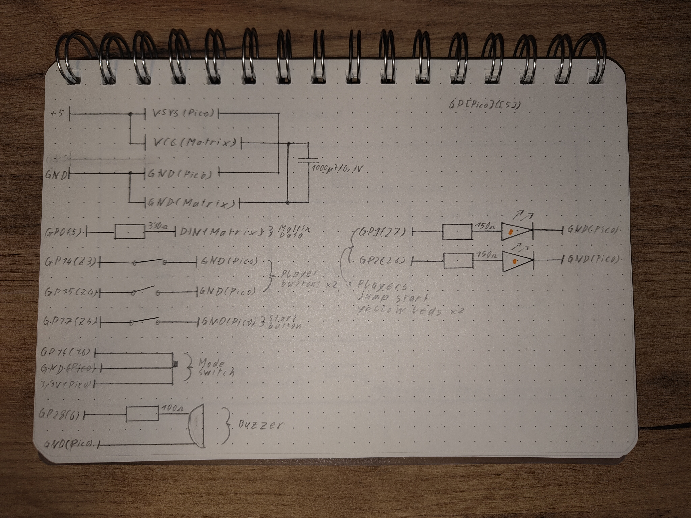
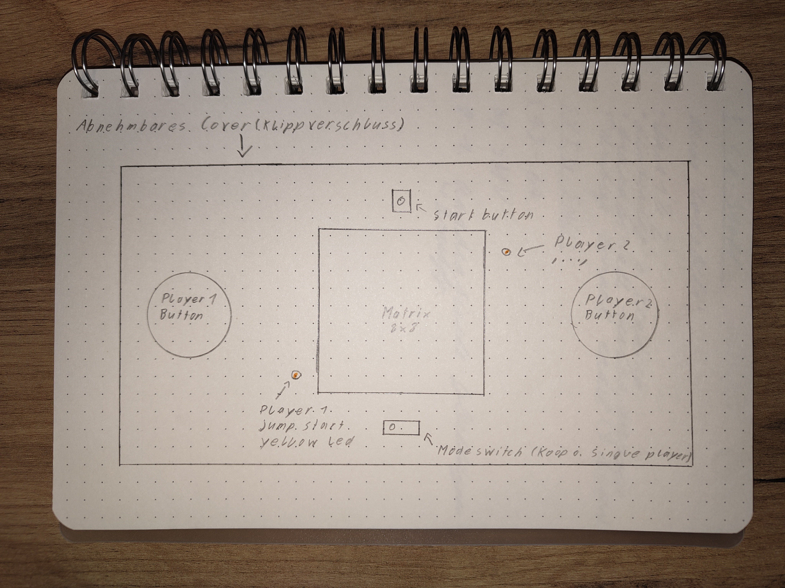

# PYTHON-Reaction-Board-Game
Concept Reaction Game implemented in Python/MicroPython for the Raspberry Pi Pico. Features single- and two-player modes with LED matrix feedback and buzzer sounds. ⚠️ Prototype only – untested, hardware required.

---

## Project Overview

This project is a reaction-based game for the Raspberry Pi Pico using MicroPython.  
It supports:
- **Single Player** mode – measures reaction time
- **Two Player** mode – compete against another player
- Visual feedback via an 8x8 NeoPixel matrix
- Audio feedback via a buzzer

The code is intended as a **prototype / concept**, not tested on actual hardware.

---

## Hardware Setup

- **Microcontroller:** Raspberry Pi Pico  
- **Buttons:**  
  - Player 1: GPIO 14  
  - Player 2: GPIO 15  
  - Start: GPIO 17  
  - Mode Switch: GPIO 16  
- **LEDs:**  
  - Player 1 yellow LED: GPIO 1  
  - Player 2 yellow LED: GPIO 2  
- **Buzzer:** GPIO 6 (PWM)  
- **NeoPixel Matrix:** GPIO 0 (8x8)

> ⚠️ Pin assignments are preliminary and may need adjustment.

---

## Game Modes

- **Single Player Mode:** Press the button as fast as possible after the LED matrix turns green.  
- **Two Player Mode:** Compete against another player; the first to react wins.  
- Reaction time is displayed on the LED matrix as a colored bar (green = fast, yellow = medium, red = slow).

---

## Usage

1. Connect hardware as described in [Hardware Setup](/docs/img/wiring_sketch_v1).  
2. Upload `main.py` from either `micropython/` folder to your Pico or `python/` folder to your Pi 5 or older.  
3. Power the board and press the start button.  
4. Switch between single and two-player mode using the mode switch.

---

## Screenshots / Sketches

### Wiring Diagram

Hand-drawn wiring sketch (conceptual, untested):

### Device Concept
Top-down concept sketch of the device / housing:

---

## Status

⚠️ **Prototype only** – the game is untested due to missing hardware.  
This project should be considered a **concept** and may require adjustments to work on real hardware.

---

## About
Created by Manuel Amberger, a student at a technical high school (HTL) in austria.
